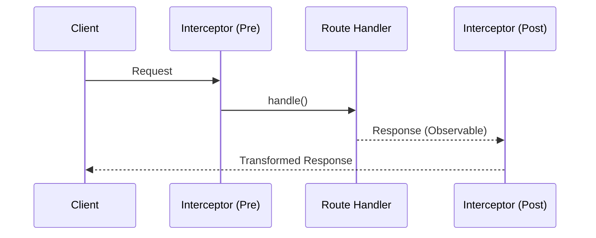

# Advanced Nest JS
## Exception Filters, Interceptors & More

---

# Agenda

- 📝 Exception Filters
- 🛡️ Interceptors
- 🎨 Custom Decorators
- 🏭 Custom Providers

---
layout: section
---
# Part 1: Exception Filters
## Handling errors gracefully

---

# 🤔 The Problem: Inconsistent Error Handling

Imagine you have **10 controllers** and each one handles errors differently...

```typescript
// users.controller.ts
@Get(':id')
async findOne(@Param('id') id: string) {
  try {
    return await this.usersService.findOne(id);
  } catch (error) {
    // ❌ Each developer writes different error responses
    return { error: 'User not found', code: 404 };
  }
}
```

**Result**: Your API returns errors in 10 different formats! 😱

---
layout: center
---

# From Chaos to Order

````md magic-move
```ts
// ❌ BEFORE: Messy try/catch in every method
@Get(':id')
async findOne(@Param('id') id: string) {
  try {
    const user = await this.usersService.findOne(id);
    if (!user) {
      return { error: 'Not found', status: 404 };
    }
    return user;
  } catch (error) {
    console.error(error);
    return { message: 'Something went wrong' };
  }
}
```

```ts
// ✅ AFTER: Clean code, errors handled centrally
@Get(':id')
async findOne(@Param('id') id: string) {
  const user = await this.usersService.findOne(id);
  if (!user) {
    throw new NotFoundException('User not found');
  }
  return user;
}
```
````


---
layout: two-cols
---

# Global Exception Filter

## Why do we need this?
- 🧹 **Centralized Logic**: Write error handling once
- 🔄 **Standardization**: All errors have the same format
- 🕵️ **Logging**: Catch & log unexpected errors

::right::

```typescript
@Catch(HttpException)
export class HttpExceptionFilter 
  implements ExceptionFilter {
  
  catch(exception: HttpException, 
        host: ArgumentsHost) {
    const ctx = host.switchToHttp();
    const response = ctx.getResponse<Response>();
    const status = exception.getStatus();

    response.status(status).json({
      statusCode: status,
      timestamp: new Date().toISOString(),
      path: ctx.getRequest().url,
    });
  }
}
```

---

# 📚 Syntax Breakdown: Exception Filter

| Syntax | What it means |
|--------|---------------|
| `@Catch(HttpException)` | **Decorator**: Tells NestJS "this class catches HttpExceptions" |
| `implements ExceptionFilter` | **Interface**: A contract. We MUST implement the `catch()` method |
| `ArgumentsHost` | **Abstraction**: Works with HTTP, WebSocket, GraphQL, etc. |
| `host.switchToHttp()` | **Method**: Switch to HTTP context to access Request/Response |

<br>

> 💡 **OOP Concept**: `implements` means we're signing a contract. If we don't write a `catch()` method, TypeScript will yell at us!

---

# Applying the Filter

Three levels of scope:

```typescript
// 1. Method Scope - Only this endpoint
@Get()
@UseFilters(HttpExceptionFilter)
findAll() { ... }

// 2. Controller Scope - All endpoints in this controller
@Controller('users')
@UseFilters(HttpExceptionFilter)
export class UsersController { ... }

// 3. Global Scope - EVERY endpoint in the app (most common)
// main.ts
app.useGlobalFilters(new HttpExceptionFilter());
```

---

# 🤔 Pourquoi un Custom Filter ?

Sans filtre personnalisé, NestJS utilise son **filtre par défaut** (basique et rigide).

<br>

### Sans Custom Filter (Réponse `/bug`)
```json
{
  "statusCode": 403,
  "message": "Ceci est une erreur simulée"
}
```

### Avec Ton Custom Filter
```json
{
  "statusCode": 403,
  "message": "Ceci est une erreur simulée",
  "timestamp": "2024-12-28T22:15:30.123Z",
  "path": "/bug"
}
```

---

# 🎯 Défaut vs Custom Filter

| Caractéristique | Sans Filtre (Défaut) 😐 | Avec Custom Filter 😎 |
| :--- | :--- | :--- |
| **Heure de l'erreur** | ❌ Absente | ✅ Présente (`timestamp`) |
| **URL concernée** | ❌ Absente | ✅ Présente (`path`) |
| **Structure JSON** | Imposée par NestJS | Tu contrôles 100% |
| **Debugging** | Difficile (manque de contexte) | Facile avec URL + heure |

---

# ⚠️ Le Problème des Erreurs Inconnues

Que se passe-t-il avec une erreur non-HTTP ? (ex: `TypeError`)

<br>

### Défaut NestJS (pour sécurité)
```json
{
  "statusCode": 500,
  "message": "Internal server error"
}
```
> C'est tout ! 😱 Tu ne sais rien de plus.

<br>

### Avec Custom Filter
```typescript
catch(exception: unknown, host: ArgumentsHost) {
  // 🔍 Toi (dev) tu vois l'erreur dans le terminal
  console.error('Erreur détectée:', exception);
  
  // 👤 L'utilisateur reçoit un message propre
  response.status(500).json({
    message: 'Une erreur est survenue',
    timestamp: new Date().toISOString(),
    path: request.url,
  });
}
```

---

# 👨‍💻 Teste-le toi-même !

Pour voir la différence de tes propres yeux :

<br>

**1.** Va dans `src/main.ts`

**2.** Commente la ligne :
```typescript
// app.useGlobalFilters(new HttpExceptionFilter());
```

**3.** Sauvegarde (le serveur redémarre)

**4.** Refais la requête sur `/bug`

<br>

> 💡 Tu verras le JSON "maigre" de NestJS. C'est ça que ton Custom Filter améliore !

---
layout: section
---

# Part 2: Interceptors
## Transform data before & after

---

# 🤔 The Problem: Inconsistent API Responses

Your frontend team is frustrated...

```json
// Endpoint 1: GET /users
{ "id": 1, "name": "John" }

// Endpoint 2: GET /products  
{ "data": { "id": 1, "name": "iPhone" } }

// Endpoint 3: GET /orders
[ { "id": 1 }, { "id": 2 } ]
```

**Result**: Frontend has to handle 3 different response formats! 😤

---
layout: center
---

# Interceptors Lifecycle



---
layout: center
---

# Response Transformation

````md magic-move
```ts
// ❌ BEFORE: Raw response, no standard format
@Get(':id')
async findOne(@Param('id') id: string) {
  return await this.usersService.findOne(id);
}
// Response: { "id": 1, "name": "John" }
```

```ts
// ✅ AFTER: Wrapped response with metadata
@Get(':id')
@UseInterceptors(TransformInterceptor)
async findOne(@Param('id') id: string) {
  return await this.usersService.findOne(id);
}
// Response: { "data": { "id": 1, "name": "John" }, "statusCode": 200, "timestamp": "..." }
```
````

---
layout: two-cols
---

# Implementing the Interceptor

Every response wrapped in `{ data, statusCode, timestamp }`

::right::

```typescript
@Injectable()
export class TransformInterceptor<T> 
  implements NestInterceptor<T, Response<T>> {
  
  intercept(
    context: ExecutionContext, 
    next: CallHandler
  ): Observable<Response<T>> {
    
    return next.handle().pipe(
      map(data => ({ 
        data, 
        statusCode: context
          .switchToHttp()
          .getResponse().statusCode,
        timestamp: new Date().toISOString()
      }))
    );
  }
}
```

---

# 📚 Syntax Breakdown: Interceptor

| Syntax | What it means |
|--------|---------------|
| `@Injectable()` | **Decorator**: Makes this class available for Dependency Injection |
| `<T>` | **Generic**: T is a placeholder for ANY type (User, Product, etc.) |
| `implements NestInterceptor<T, Response<T>>` | **Interface**: Input type `T`, Output type `Response<T>` |
| `next.handle()` | **Observable**: The response stream from the route handler |
| `.pipe(map(...))` | **RxJS**: Transform the stream before sending to client |

<br>

> 💡 **OOP Concept**: Generics (`<T>`) let us write ONE interceptor that works with ALL response types!

---

# Applying Interceptors

Same three levels as Filters:

```typescript
// 1. Method Scope
@Get()
@UseInterceptors(TransformInterceptor)
findAll() { ... }

// 2. Controller Scope
@Controller('cats')
@UseInterceptors(TransformInterceptor)
export class CatsController { ... }

// 3. Global Scope (recommended for response format)
app.useGlobalInterceptors(new TransformInterceptor());
```

---

# 🛠️ More Interceptor Use Cases

```typescript
// 1. LoggingInterceptor - Measure request duration
intercept(context, next) {
  const start = Date.now();
  return next.handle().pipe(
    tap(() => console.log(`Request took ${Date.now() - start}ms`))
  );
}

// 2. CacheInterceptor - Return cached response
intercept(context, next) {
  const cached = this.cache.get(key);
  if (cached) return of(cached);
  return next.handle().pipe(tap(data => this.cache.set(key, data)));
}

// 3. TimeoutInterceptor - Abort slow requests
intercept(context, next) {
  return next.handle().pipe(timeout(5000));
}
```

---
layout: section
---

# Part 3: Custom Decorators
## Clean up your controllers

---

# 🤔 The Problem: Repetitive Boilerplate

Every controller needs to access the authenticated user...

```typescript
@Get('profile')
getProfile(@Req() req: Request) {
  const user = req.user;  // ❌ No type safety! What is `user`?
  return user;
}

@Get('orders')
getOrders(@Req() req: Request) {
  const user = req.user;  // ❌ Repeated in every method!
  return this.ordersService.findByUser(user.id);
}
```

**Problems**: No type safety, repetitive code, tied to Express/Fastify request object

---
layout: center
---

# From Boilerplate to Custom Decorators

````md magic-move
```ts
// ❌ The "Old" Way
@Get()
getProfile(@Req() req: Request) {
  // We have to trust that 'user' exists
  // and type it manually
  const user = req.user; 
  return user;
}
```

```ts
// ✅ The Custom Decorator Way
@Get()
getProfile(@User() user: UserEntity) {
  return user;
}
```
````

---

# Why This Matters

| Old Way | Custom Decorator |
|---------|------------------|
| `req.user` is type `any` | `user: UserEntity` is fully typed |
| Must import `@Req()` everywhere | Import `@User()` once |
| Tied to Request object | Decoupled, easy to test |
| Hard to mock in tests | Easy to mock |

<br>

> 💡 **Clean Code**: Your controller methods become **self-documenting**. Anyone reading `getProfile(@User() user)` immediately understands what's happening.

---
layout: center
---

# Creating the `@User()` Decorator

`createParamDecorator` is a **factory function** provided by NestJS.

```typescript
import { createParamDecorator, ExecutionContext } from '@nestjs/common';

export const User = createParamDecorator(
  (data: unknown, ctx: ExecutionContext) => {
    const request = ctx.switchToHttp().getRequest();
    // AuthGuard attached the user to the request
    return request.user;
  },
);
```

---

# 📚 Syntax Breakdown: createParamDecorator

| Syntax | What it means |
|--------|---------------|
| `createParamDecorator()` | **Factory Function**: Returns a new decorator |
| `data: unknown` | Optional data passed to decorator: `@User('email')` |
| `ExecutionContext` | Same abstraction as in Filters/Interceptors |
| `ctx.switchToHttp()` | Switch to HTTP context |
| `return request.user` | What gets injected into the parameter |

<br>

> 💡 **Factory Pattern**: `createParamDecorator` is a factory that creates custom parameter decorators. You give it a function, it returns a decorator!

---

# Decorator Composition

Combine multiple decorators into one with `applyDecorators`:

```typescript
import { applyDecorators, SetMetadata, UseGuards } from '@nestjs/common';

export function Auth(...roles: Role[]) {
  return applyDecorators(
    SetMetadata('roles', roles),   // Store roles in metadata
    UseGuards(AuthGuard, RolesGuard), // Apply guards
    ApiBearerAuth(),               // Swagger documentation
    ApiUnauthorizedResponse({ description: 'Unauthorized' }),
  );
}
```

**Before vs After:**
```typescript
// ❌ Before: 4 decorators on every protected route
@SetMetadata('roles', ['admin'])
@UseGuards(AuthGuard, RolesGuard)
@ApiBearerAuth()
findAll() { ... }

// ✅ After: 1 clean decorator
@Auth('admin')
findAll() { ... }
```

---

# 🛠️ More Decorator Examples

```typescript
// 1. @CurrentTenant() for multi-tenant apps
export const CurrentTenant = createParamDecorator(
  (data: unknown, ctx: ExecutionContext) => {
    const request = ctx.switchToHttp().getRequest();
    return request.headers['x-tenant-id'];
  },
);

// 2. @Public() to skip authentication
export const IS_PUBLIC_KEY = 'isPublic';
export const Public = () => SetMetadata(IS_PUBLIC_KEY, true);

// Usage:
@Public()
@Get('health')
healthCheck() { return 'OK'; }
```

---
layout: section
---

# Part 4: Custom Providers
## Beyond standard Dependency Injection

---

# 🤔 The Problem: Hardcoded Dependencies

How do you swap implementations for testing or different environments?

```typescript
// ❌ Hardcoded payment gateway - impossible to test!
@Injectable()
export class OrdersService {
  private payment = new StripePaymentService(); // 😱 Can't swap this!
  
  async createOrder(order: Order) {
    await this.payment.charge(order.total); // Charges real money in tests!
  }
}
```

**Problems**: Can't mock for testing, can't swap for different environments

---

# What are Custom Providers?

Standard DI in NestJS:
```typescript
providers: [CatsService]  // Shorthand for:
providers: [{ provide: CatsService, useClass: CatsService }]
```

Custom providers give you **control** over what gets injected:

| Provider Type | Use Case |
|---------------|----------|
| `useClass` | Swap implementations (Dev/Prod, Mock/Real) |
| `useValue` | Inject config objects, constants |
| `useFactory` | Create providers dynamically |
| `useExisting` | Alias one provider to another |

---
layout: center
---

# useClass: Swapping Implementations

````md magic-move
```ts
// ❌ BEFORE: Production service always used
@Module({
  providers: [PaymentService],  // Always StripePaymentService
})
export class PaymentsModule {}
```

```ts
// ✅ AFTER: Swap based on environment
@Module({
  providers: [{
    provide: PaymentService,
    useClass: process.env.NODE_ENV === 'test'
      ? MockPaymentService
      : StripePaymentService,
  }],
})
export class PaymentsModule {}
```
````

---
layout: two-cols
---

# useValue (Config & Mocking)

Inject a simple object literal. Useful for testing or configuration.

```typescript
// app.module.ts
const connectionConfig = {
  url: 'postgres://localhost:5432',
  retryAttempts: 3
};

@Module({
  providers: [
    {
      provide: 'DATABASE_CONFIG',
      useValue: connectionConfig,
    },
  ],
})
export class AppModule {}
```

::right::

# useFactory (Dynamic)

Create a provider dynamically with dependencies.

```typescript
const connectionFactory = {
  provide: 'CONNECTION',
  useFactory: async (
    config: ConfigService
  ) => {
    const url = config.get('DATABASE_URL');
    return new DatabaseConnection(url);
  },
  inject: [ConfigService], // Dependencies
};
```

> 💡 `inject` tells NestJS which providers to pass to `useFactory`

---

# 📚 Syntax Breakdown: Custom Providers

| Property | What it means |
|----------|---------------|
| `provide` | **Token**: The identifier used to inject (class or string) |
| `useClass` | **Substitute**: Replace with a different class |
| `useValue` | **Literal**: Inject this exact object |
| `useFactory` | **Function**: Call this function to create the value |
| `inject` | **Dependencies**: What to pass to useFactory |

<br>

> 💡 **DI Pattern**: Custom providers implement the **Strategy Pattern** - you decide at runtime which implementation to use!

---

# Provider Scopes

By default, everything in NestJS is a **Singleton**. Sometimes you need isolation.

| Scope | Description | Use Case |
|-------|-------------|----------|
| `DEFAULT` | Singleton. Created once. | 99% of services |
| `REQUEST` | Created per HTTP request | Multi-tenancy, Request-scoped logging |
| `TRANSIENT` | New instance every injection | Lightweight stateless helpers |

```typescript
@Injectable({ scope: Scope.REQUEST })
export class TenantService {
  // New instance for each request!
  // Perfect for multi-tenant apps
}
```

---

# 🛠️ Real Use Case: Multi-tenant App

```typescript
@Injectable({ scope: Scope.REQUEST })
export class TenantService {
  constructor(@Inject(REQUEST) private request: Request) {}
  
  getTenantId(): string {
    return this.request.headers['x-tenant-id'];
  }
  
  getDatabaseConnection(): Connection {
    // Return connection for THIS tenant's database
    return this.connectionPool.get(this.getTenantId());
  }
}
```

> Each request gets its own `TenantService` instance with access to its own database!

---

# 📚 Resources

Learn more about these concepts:

| Topic | Link |
|-------|------|
| Exception Filters | [docs.nestjs.com/exception-filters](https://docs.nestjs.com/exception-filters) |
| Interceptors | [docs.nestjs.com/interceptors](https://docs.nestjs.com/interceptors) |
| Custom Decorators | [docs.nestjs.com/custom-decorators](https://docs.nestjs.com/custom-decorators) |
| Custom Providers | [docs.nestjs.com/fundamentals/custom-providers](https://docs.nestjs.com/fundamentals/custom-providers) |

---
layout: cover
background: https://images.unsplash.com/photo-1454165804606-c3d57bc86b40?q=80&w=2070&auto=format&fit=crop
---

# Thank You!

## Questions?

**Key Takeaways:**
- 🧹 **Exception Filters**: Centralize error handling
- 🔄 **Interceptors**: Transform data in/out
- 🎨 **Custom Decorators**: Clean, reusable code
- 🏭 **Custom Providers**: Flexible dependency injection
